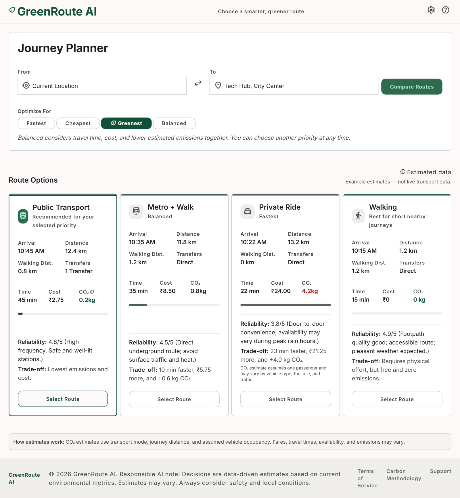
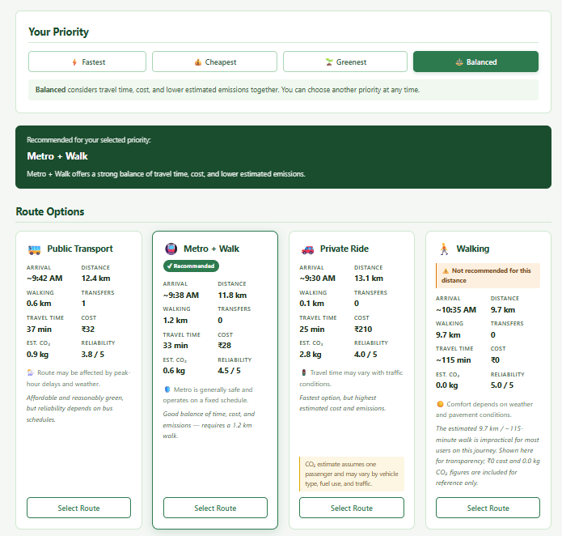
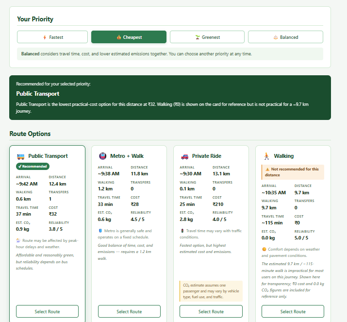
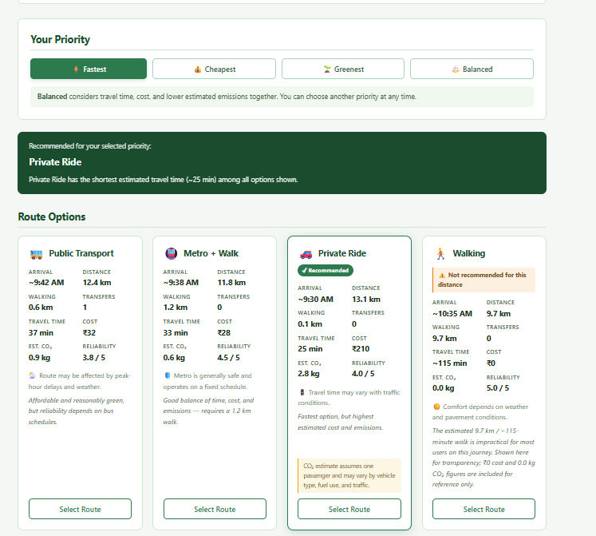
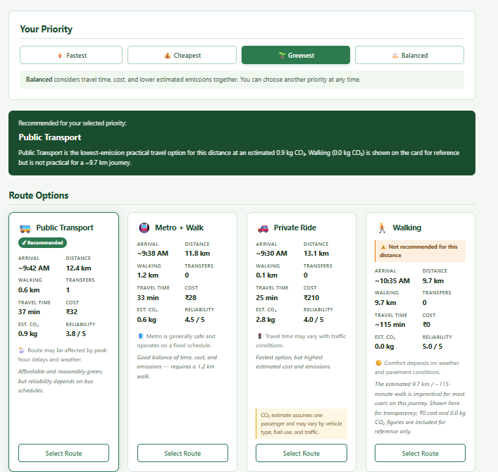
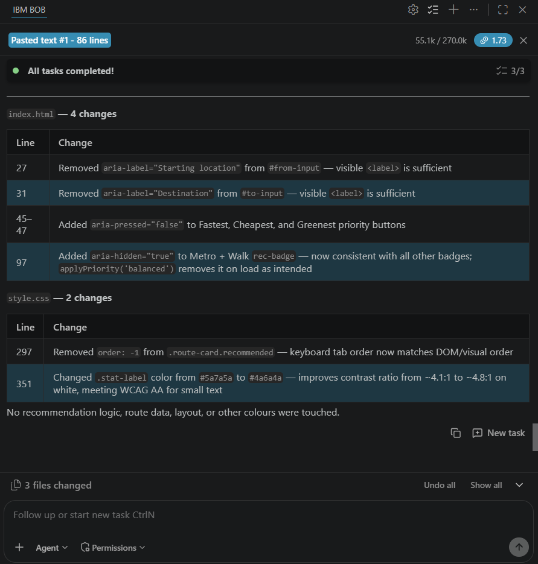

# GreenRoute AI

**Tagline:** Choose a smarter, greener route

## 1. Project Overview
GreenRoute AI is a transparent travel decision-support prototype that helps commuters compare different travel options using practical factors such as travel time, cost, estimated CO₂ emissions, walking distance, transfers, and reliability. This project was created as a submission for the 1M1B AI for Sustainability Virtual Internship.

## 2. Problem Statement
Commuters often lack visibility into the environmental impact of their daily travel choices. When information is available, it rarely balances emissions with other crucial factors like cost, time, and convenience, making it difficult for users to make informed, sustainable decisions that also meet their personal constraints.

## 3. Solution
GreenRoute AI addresses this by providing a comprehensive comparison of various route options. The system does not simply force users to select the route with the lowest emissions. Instead, it allows users to choose their priority and makes the trade-offs between time, cost, emissions, convenience, walking distance, and reliability clearly visible.

## 4. Key Features
- **Transparent Trade-offs:** Clearly displays the balance between time, cost, emissions, and walking distance.
- **Priority Selection:** Users can tailor recommendations based on their most pressing need.
- **Multiple Transport Modes:** Compares public transit, mixed modes, private rides, and walking.

## 5. Route Priorities
Users can select from the following priorities:
- Fastest
- Cheapest
- Greenest
- Balanced

## 6. Route Options
The prototype evaluates the following transport methods:
- Public Transport
- Metro + Walk
- Private Ride
- Walking

## 7. How It Works
Users input their starting location and destination. Based on their selected route priority, GreenRoute AI evaluates the available route options and highlights the one that best fits their needs, while presenting the associated costs, times, and environmental impacts of all options for full transparency.

## 8. AI and IBM Bob
IBM Bob was used extensively during the development of this prototype. It assisted with code analysis, troubleshooting, accessibility reviews, and overall improvement of the prototype's codebase.

## 9. User Research and Testing
The project included user research and testing with five commuters. Their feedback was instrumental in improving the prototype. Key improvements based on this feedback include:
- Clearer explanation of route trade-offs
- Assessment of walking suitability
- Explanations for the provided estimates
- Responsible-AI warnings
- Consideration of reliability and safety

## 10. Responsible AI and Limitations
**Important Note:** The current prototype uses example estimates and is NOT connected to live transport data. 
- It does not use real-time routing, live traffic, or live transit availability.
- It does not provide exact CO₂ measurements or verified real-time emissions.
- Travel times, fares, transit availability, and emissions are illustrative and can vary significantly in the real world.

## 11. SDG Alignment
This project aligns with the following United Nations Sustainable Development Goals:
- **SDG 11:** Sustainable Cities and Communities
- **SDG 13:** Climate Action

## 12. Project Structure

```text
greenroute-ai/
├── research/
│   └── user-research-and-testing.docx
├── screenshots/
│   ├── balanced-test.png
│   ├── cheapest-test.png
│   ├── fastest-test.png
│   ├── greenest-test.png
│   ├── ibm-bob-code-review.png
│   └── prototype-after-user-testing.png
├── presentation/
│   └── GreenRoute_AI_Project_Presentation.pptx
├── index.html
├── script.js
├── style.css
└── README.md
```

## 13. Running the Project
This is a static frontend prototype. To view the project:
1. Clone or download this repository.
2. Open `index.html` in any modern web browser.
No build tools, servers, or external API keys are required.

## 14. Screenshots

**Prototype After User Testing:**


**Balanced Priority Test:**


**Cheapest Priority Test:**


**Fastest Priority Test:**


**Greenest Priority Test:**


**IBM Bob Code Review:**


## 15. Project Presentation
[View Project Presentation](presentation/GreenRoute_AI_Project_Presentation.pptx)

## 16. Future Improvements
The following are planned as **future** improvements and are not currently implemented:
- Integration with live transport data
- Real-time traffic information
- Real-time weather information
- Verified emissions factors
- Real-time availability for transit and rides
- Stronger safety and reliability signals
- Improved personalization features

## 17. Author
GreenRoute AI was developed as part of the 1M1B AI for Sustainability Virtual Internship.
